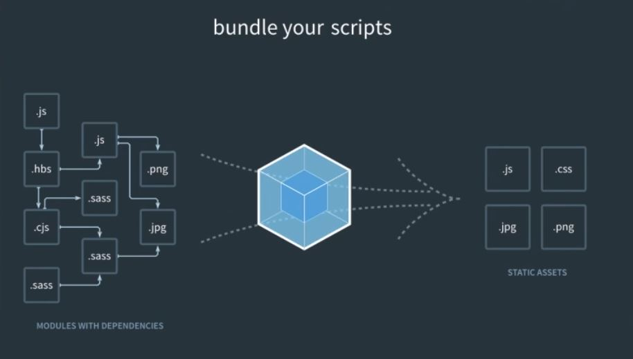
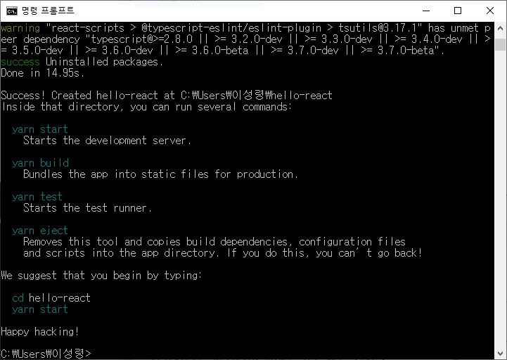

> 🎧 20.02.28 <br>
> 🧩 인프런 - 누구든지 하는 리액트: 초심자를 위한 react 핵심 강좌 ([https://www.inflearn.com/course/react-velopert](https://www.inflearn.com/course/react-velopert))

# Ch 2. 리액트 프로젝트 시작하기

<br>

## <1> 본격적인 리액트 코드 작성하기

**Webpack** : 코드들을 의존하는 순서대로 합쳐서 하나 또는 여러 개의 파일로 결과물을 만들어 냄 <br>
쉽게 말하자면 웹 프로젝트를 만들 때 전체적인 파일을 관리하는 도구 <br>
 <br><br>
**Babel** : 자바스크립트 변환 도구 <br>
자바스크립트는 계속해서 새로운 문법을 만들어내는데 Node.js나 브라우저가 바로 습득하지는 못하기 때문에 이를 도와줌

(* 초기 단기에서는 Webpack과 Babel을 건드릴 일은 없기에 이런 도구가 있다~ 정도만 숙지할 것)

<br>

**실습 준비**

> **Node.js** (https://nodejs.org/ko/download) <br>
> **Yarn** (https://classic.yarnpkg.com/en/docs/install) <br>
> **VS Code** (https://code.visualstudio.com) <br>
> **CodeSandbox** (https://bit.ly/beginreact) (초보자 실습용)

**설치(Window)**<br>
cmd 창을 열어서<br>
```
npm install -g create-react-app
```
<br>

**사용**<br>
cmd 창을 열어서<br>
```
create-react-app hello-react
```
<br>
↑ 성공적으로 설치됐음을 알리는 문구<br>
<br>
리액트 프로젝트 시작<br>
```
cd hello-react
yarn start
```
브라우저창에서 Welcome to React 페이지가 뜨면 성공
