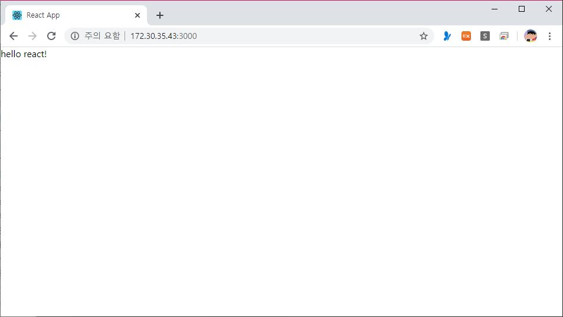
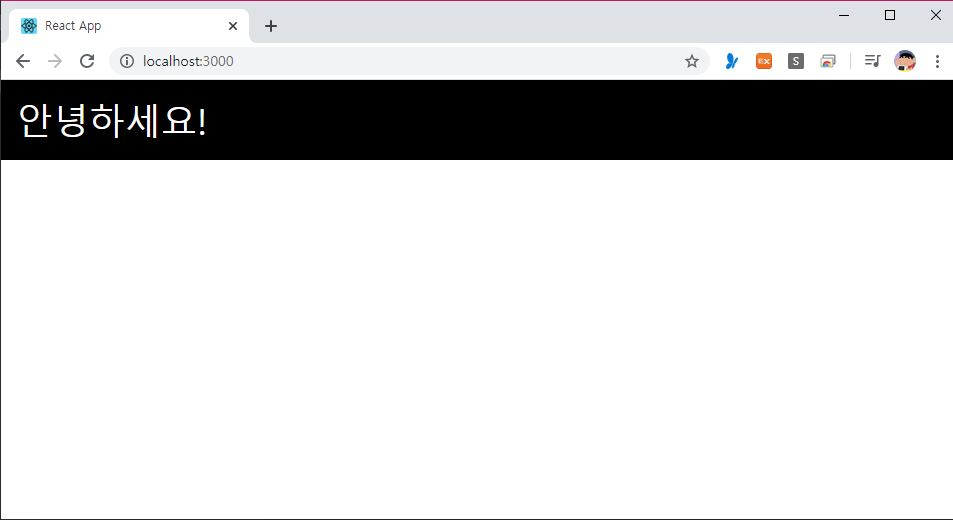
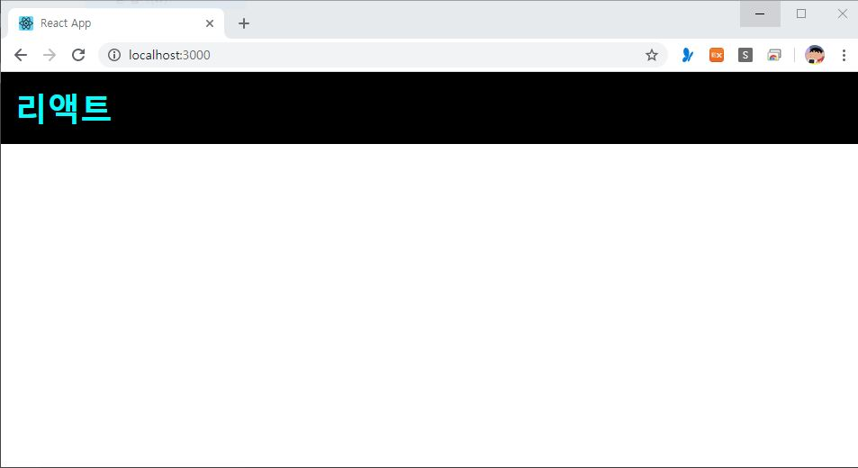

> 🎧 20.03.06 <br>
> 🧩 인프런 - 누구든지 하는 리액트: 초심자를 위한 react 핵심 강좌 ([https://www.inflearn.com/course/react-velopert](https://www.inflearn.com/course/react-velopert))


# Ch 3. JSX

<br>

## <1> JSX 기본 문법 알아보기 (i)


**JSX** : 리액트 컴포넌트를 작성할 때 사용하는 문법. <br>
HTML이랑 비슷하지만 지켜야 할 **규칙**이 몇가지 있으며 이를 작성하면 JS 형태로 변환시켜줌 <br><br>

**규칙 1. 꼭 닫혀야 하는 태그** <br>
태그는 꼭 닫혀있어야 함<br>
```
import React, { Component } from 'react';
    
class App extends Component {
  render() {
    return (
      <div>
        <input type="text">
     </div>
    );
  }
}
    
export default App;
```
↑ input을 닫아주지 않았기 때문에 오류가 나는 경우 <br>

```
          <div>
            <input type="text" />
          </div>
```
↑ 셀프 클로징 태그 ( **/>**  : 한 번 연 태그를 그 자리에서 닫는 역할) 를 이용해 오류 해결<br>
<br>

**규칙 2. 감싸져 있는 엘리먼트**<br>
두 개 이상의 엘리먼트는 무조건 하나의 엘리먼트로 감싸져있어야 함<br>
```
// src/App.js
import React, { Component } from 'react';

class App extends Component {
  render() {
    return (
      <div> Hello </div>
      <div> Bye </div>
    );
  }
}

export default App;
```
↑ return 내에 div가 두개, 즉 두개의 엘리먼트가 존재하여 오류가 나는 경우 <br>

```
      <Fragment>
	    <div> Hello </div>
        <div> Bye </div>
      </Fragment>
```
↑ Fragment(div로 묶어도 되지만 불필요한 div 사용을 보완하기 위해 등장한 기능)를 이용해 div 두개를 감싸주어 해결<br>
<br><br>

**JSX 내부에서 자바스크립트 값 사용하기**<br>
```
import React, { Component } from 'react';

class App extends Component {
  render() {
    const name = 'react'; // name이라는 값을 만들고
    return (
      <div>
        hello {name}! {/* 여기에서 나타나게 만들기 */}
      </div>
    );
  }
}

export default App;
```


<br>
↑ 결과물<br>
{name} 대신에 react가 들어갔음을 확인할 수 있음<br>

<br>

> *const : 한 번 선언하고 고정적인 값<br>
> *let : 선언 후 바뀌게 될 수 있는 유동적인 값<br><br>
> *기존의 자바스크립트의 var와 비슷하나 작동방식에 있어 scope가 다름<br>
>  var은 scope가 함수단위, const와 let은 블록단위 임<br>

```
function foo() {
  var a = 'hello';
  if (true) {
    var a = 'bye';
    console.log(a); // bye
  }
  console.log(a); // bye
}
```
> ↑ scope가 함수 단위인 var의 예시<br>
```
function foo() {
  let a = 'hello';
  if (true) {
    let a = 'bye';
    console.log(a); // bye
  }
  console.log(a); // hello
}
```
>↑ scope가 블록 단위인 let의 예시<br><br>
> 참고로 ES6에서는 var 쓸 일이 없음. let과 const만.

<br><br>

**조건부 렌더링**<br>

조건부 렌더링을 할 때 주로 삼항 연산자나 AND연산자를 이용함. if문은 사용할 수 없음.<br>

```
import React, { Component } from 'react';

class App extends Component {
  render() {
    return (
      <div>
        {
          1 + 1 === 2 
            ? (<div>맞아요!</div>)
            : (<div>틀려요!</div>)
        }
      </div>
    );
  }
}

export default App;
```
↑ 삼항 연산자 예시<br>
```
      <div>
        {
          1 + 1 === 2 && (<div>맞아요!</div>)
        }
      </div>
```
↑ and 연산자(&&) 예시<br>

조건이 여러개일 경우, 웬만하면 JSX 밖에서 로직을 작성하는 것이 좋지만 굳이 JSX 내부에서 작성하고 싶다면 IIFE(함수를 바로 선언하고 이용)를 이용.<br>
```
import React, { Component } from 'react';

class App extends Component {
  render() {
    const value = 1;
    return (
      <div>
        {
          (function() {
            if (value === 1) return (<div>하나</div>);
            if (value === 2) return (<div>둘</div>);
            if (value === 3) return (<div>셋</div>);
          })()
        }
      </div>
    );
  }
}

export default App;
```
↑ IIFE 예시 1<br>
```
      <div>
        {
          (() => { {/* 화살표 함수 이용 */}
            if (value === 1) return (<div>하나</div>);
            if (value === 2) return (<div>둘</div>);
            if (value === 3) return (<div>셋</div>);
          })()
        }
      </div>
```
↑ IIFE 예시 2<br>

<br>

## <2> JSX 기본 문법 알아보기 (ii)


JSX에서 style과 css 클래스 설정하는 것은 html과 사뭇 다름<br><br>

**style 설정**
```  
<!DOCTYPE html>
<html>
<head>
  <meta charset="utf-8">
  <meta name="viewport" content="width=device-width">
  <title>JS Bin</title>
</head>
<body>
  <div style="background-color: black; padding: 16px; color: white; font-size: 36px;">안녕하세요!</div> 
</body>
</html>
```
↑ HTML로 작성<br>

```
import React, { Component } from 'react';

class App extends Component {
  render() {
    const style = {
      backgroundColor: 'black',
      padding: '16px',
      color: 'white',
      fontSize: '36px'
    };

    return <div style={style}>안녕하세요!</div>;
  }
}

export default App;
```
↑ React로 작성(App.js) <br><br>

(1) html에서는 css style을 작성할 때 문자열로 넣어줬지만 **react** 상에서는 **객체** 형태로 넣음<br>

(2) html에서 일부 style 이름들은 중간에 '-'가 들어가는데(ex. background-color) react에서는 새로운 단어마다 대문자로 시작(ex. backgroundColor)<br>

(3) 색상이나 숫자를 입력할 때 **' '**로 열고 닫은 문자열 형태로 작성<br>

<br>
↑ 결과물<br>

<br>

**class 설정**
```  
<!DOCTYPE html>
<html>
<head>
  <meta charset="utf-8">
  <meta name="viewport" content="width=device-width">
  <title>JS Bin</title>
</head>
<body>
  <div class="App">리액트</div>
</body>
</html>
```
```
.App {
  background-color: black;
  color: aqua;
  font-size: 36px;
  padding: 1rem;
  font-weight: 600;
}
```
↑ HTML과 CSS로 작성<br>

```
import React, { Component } from 'react';
import './App.css' //불러올 css 파일

class App extends Component {
  render() {
    return (
      <div className="App">리액트</div>
    );
  }
}

export default App;
```
↑ React로 작성(App.js) <br><br>

(1) class가 아닌 **className**을 이용함<br>

(2) import를 이용해 연결한 css 파일을 불러옴<br>

<br>
↑ 결과물<br>

<br><br>
**주석 작성 방법**<br>
```
import React, { Component } from 'react';

class App extends Component {
  render() {
    return (
      <div>
        {/* 주석은 이렇게 */}
        <h1
          // 태그 사이에
        >리액트</h1>
      </div>
    );
  }
}

export default App;
```
