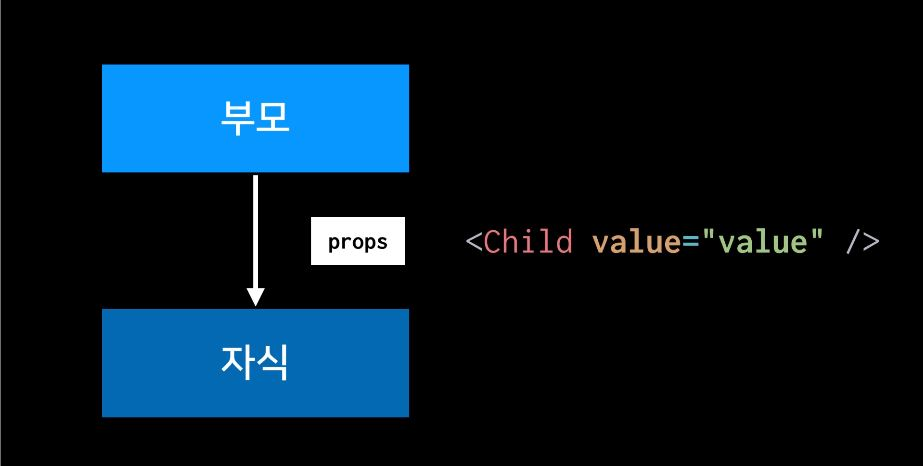
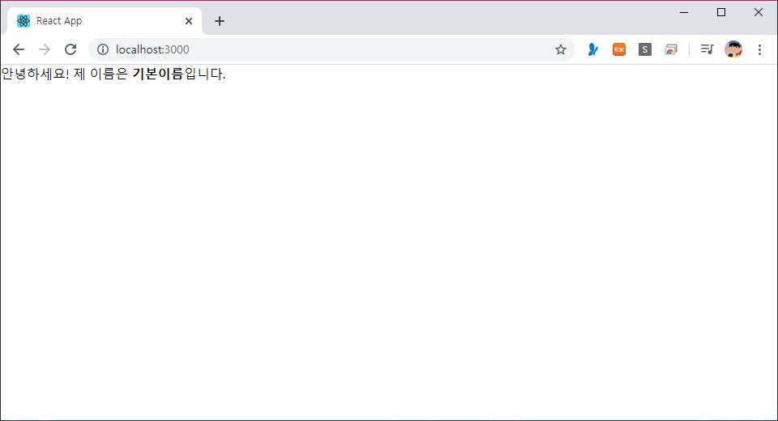
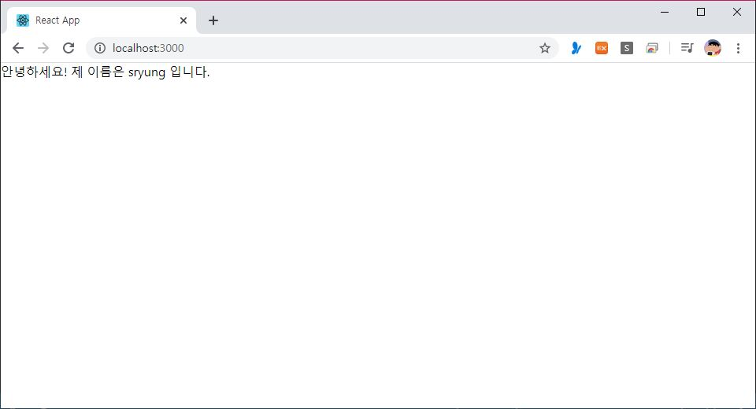
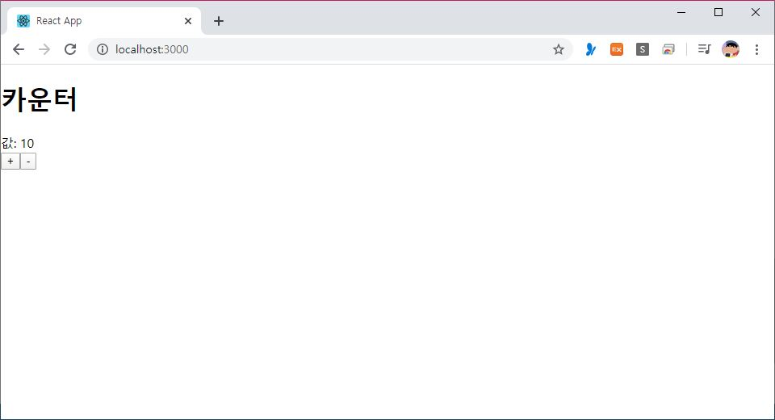

> 🎧 20.03.06 <br>
> 🧩 인프런 - 누구든지 하는 리액트: 초심자를 위한 react 핵심 강좌 ([https://www.inflearn.com/course/react-velopert](https://www.inflearn.com/course/react-velopert))


# Ch 4. Props와 State

<br>
리액트 컴포넌트에서 다루는 데이터는 props와 state 두 개로 나뉨
<br><br>

## <1> Props를 사용하는 방법

**props** : 부모 컴포넌트가 자식 컴포넌트 한테 값을 전달할 때 사용<br>
<br>
<br>


예시. 이름을 입력해보자!<br>
```
import  React, { Component } from  'react';

class  MyName  extends  Component {
  render() {
    return (
      <div>
        안녕하세요! 제 이름은 <b>{this.props.name}</b>입니다.
      </div>
    );
  }
}

export  default  MyName;
```
↑ MyName.js<br>
값을 전달 받기 위해 `{this.props.name}`를 사용<br><br>

```
import  React, { Component } from  'react';
import  MyName  from  './MyName';

class  App  extends  Component {
  render() {
    return  <MyName  name = "리액트"  />;
  }
}

export  default  App;
```
↑ App.js<br>
MyName.js를 렌더링 해 결과를 보여줌<br>
<br>
↑ 결과물<br>

<br><br>

**defaultProps** : props의 기본 값 설정<br>

만일 App.js에서 props 값을 잊어먹고 넣지 않았을 때에 대처할 방법이 됨<br>
```
    return  <MyName  />;
```
↑ App.js<br>
```
  static  defaultProps = {
    name:  '기본이름'
  }
```
↑ MyName.js **(1)**<br>
클래스 내부에 static값을 선언해주는 방법<br><br>
```
MyName.defaultProps = {
  name:  '기본이름'
}
```
↑ MyName.js (2)<br>
클래스 하단에서 선언하는 방법<br>
<br>
↑ 결과물<br><br>

사실 (1)과 (2)는 완전 똑같은 코드고, 단지 (1)이 좀 더 최신 JS문법임<br>
앞으로 기본 값을 설정할 일이 있으면 **(1)** 을 채택해 공부 할 예정<br><br><br>

**함수형 컴포넌트**<br>
코드가 더 단순하기 때문에, 가볍게 props만 가져와서 보여주기만 하는 경우에 주로 작성<br><br>
```
import  React  from  'react';

const  MyName = ({ name }) => {
  return  <div> 안녕하세요! 제 이름은 {name} 입니다. </div>
};

MyName.defaultProps = {
  name:  'sryung'
}

export  default  MyName;
```
↑ MyName.js <br>

함수형 컴포넌트를 이용하면 `{ Component }` 를 더이상 불러오지 않아도 됨. (React는 유지)<br>
`const MyName = ({ name }) =>` 에서 name 값을 props로 받아와서 `제 이름은 {name} 입니다.` 에서 사용<br><br>

<br>
↑ 결과물<br><br>

<br>
함수형 컴포넌트와 클래스형 컴포넌트의 주요 차이점은, 뒤에 배울 **State**와 **LifeCycle**이 빠져있다는 점<br>
이 덕분에 컴포넌트 초기 마운트가 아주 미세하게 빠르고 메모리 자원을 덜 사용<br>

<br><br>

## <2> State를 사용하는 방법

**state** : props 처럼 부모가 자식에게 주는 것이 아니라, 컴포넌트 자신이 갖고있는 값<br>
<br>
<br>


예시. 버튼을 눌러 숫자를 세보자!<br>
```
import  React, { Component } from  'react';

class  Counter  extends  Component {
  state = {
    number:  0
  }
  
  handleIncrease = () => {
    this.setState({
      number:  this.state.number + 1
    });
  }
  handleDecrease = () => {
    this.setState({
      number:  this.state.number - 1
    });
  }

  render() {
    return (
      <div>
        <h1>카운터</h1>
        <div>값: {this.state.number}</div>
        <button  onClick={this.handleIncrease}>+</button>
        <button  onClick={this.handleDecrease}>-</button>
      </div>
    );
  }
}

export  default  Counter;
```
↑ Counter.js<br>
값: 0으로 시작해 '+'버튼을 누르면 숫자가 1씩 증가하게, '-'버튼을 누르면 숫자가 감소하게 의도(유동적)<br><br>
(1) `state`를 우선 정의해준 뒤 안에 갖고 싶은 값 `number`를 넣고 이 값을 전달 받기 위해 `{this.state.number}`를 사용<br>
(2) 메소드 `handleIncrease` 와 `handleDecrease`를 만들고 number의 값에 변화를 주기 위한 `this.setState`를 이용<br>
> Q. 왜 handleIncrease와 handleDecrease는 화살표 함수(`= () => {}`)로 작성했는가?<br>
> A. 일반함수(`()`)로 할 경우 메소드 내에서 this가 무엇인지 모르게 됨<br>

(3) 버튼을 눌렀을 때 변화가 반영되기 위해서는 이벤트 `onClick`을 이용<br>
<br>

```
import  React, { Component } from  'react';
import  Counter  from  './Counter';

class  App  extends  Component {
  render() {
    return  <Counter  />;
  }
}

export  default  App;
```
↑ App.js<br>
Counter.js를 렌더링 해 결과를 보여줌<br>
<br>
↑ 결과물<br>
