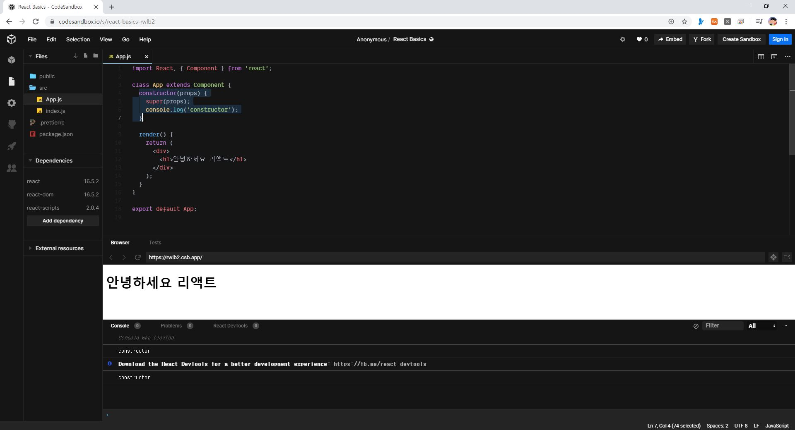
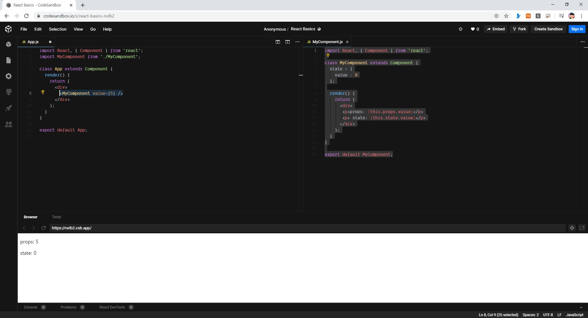
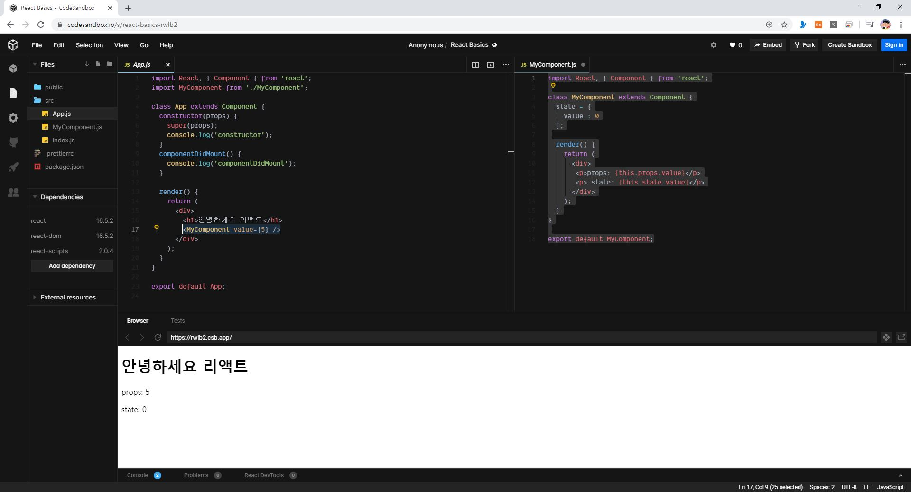
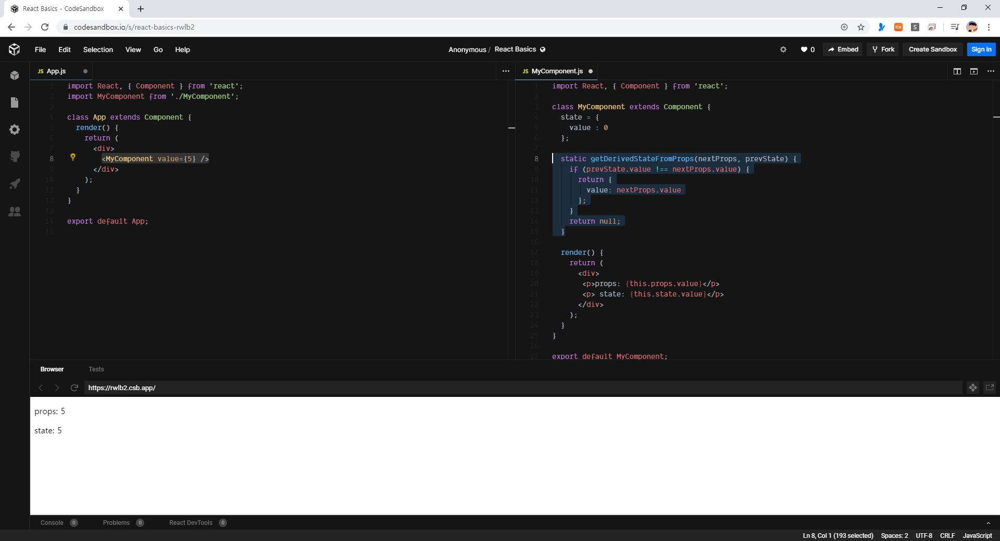
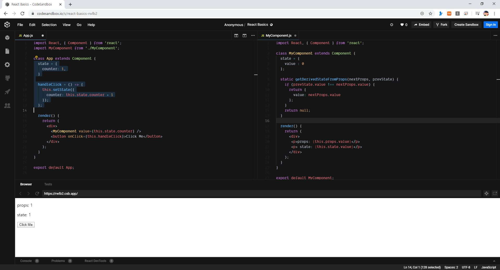

> 🎧 20.03.13 <br>
> 🧩 인프런 - 누구든지 하는 리액트: 초심자를 위한 react 핵심 강좌 ([https://www.inflearn.com/course/react-velopert](https://www.inflearn.com/course/react-velopert))


# Ch 5. LifeCycle API

<br>

## <1> LifeCycle API 소개 및 사용법 (i)


**LifeCycle API** : 생명주기 <br>
컴포넌트가 우리 브라우저 상에서 나타날 때, 업데이트 될 때, 사라질 때 이 중간 중간 과정에서 작업을 하고 싶을 때 사용<br><br>

LifeCycle API의 종류는 다양하기 때문에 사용해야 할 때 맞게 사용<br><br>

<br><br>

**Mouning** : 컴포넌트가 브라우저 상에 나타났을 때의 과정<br>

> constructor -> getDerivedStateFromProps -> render -> componentDidMount<br>

Constructor : 생성자 함수. 우리가 만든 컴포넌트가 처음 브라우저 상에 나타나게 될 때 과정 안에서 가장 먼저 실행되는 함수.  주로 컴포넌트가 가지고 있을 state 또는 미리해야하는 과정을 처리<br>
getDerivedStateFromProps : props로 받은 값을 state에다가 그대로 동결시키고 싶을 때 사용<br>
render : 어떤 dom을 만들게 될지, 내부에 있는 태그에서 어떤 값을 전달하게 될지 담음<br>
componentDidMount : 우리가 만든 컴포넌트가 실제 브라우저 상에서 나타난 시점에 어떤 작업을 하겠다는 것을 명시해 줌<br>
<br>

**Updating** : 컴포넌트의 props나 state가 바뀌었을 때의 과정<br>
> getDerivedStateFromProps -> shouldComponentUpdate -> render -> getSnapshotBeforeUpdate -> componentDidUpdate<br>

shouldComponentUpdate : 컴포넌트가 업데이트 되는 성능을 최적화시키고 싶을 때 사용. Virtual Dom에도 렌더링을 할지 말지 결정하는 함수<br>
getSnapshotBeforeUpdate : 우리가 렌더링을 한 다음에 그 결과물이 브라우저 상에 반영되기 바로 직전에 호출. 스크롤의 위치, Dom의 크기 등 정보를 들고옴<br>
componentDidUpdate : 컴포넌트가 최종 업데이트 됐을 때 호출<br>
<br>

**Unmounting** : 컴포넌트가 브라우저 상에서 사라졌을 때의 과정<br>
> componentWillUnmount<br>

componentWillUnmount : componentDidMount에서 설정할 리스너를 없애줌<br>

<br><br><br>


## <2> LifeCycle API 소개 및 사용법 (ii)


LifeCycle API들을 코드 상으로 사용하며 알아보기<br>
(bit.ly/beginreact 에 들어가 프로젝트를 fork해서 실습)<br>
```
import  React,  {  Component  }  from  'react';

class  App  extends  Component {
  render() {
    return (
      <div>
        <h1>안녕하세요 리액트</h1>
      </div>
    );
  }
}

export  default  App;
```
↑ App.js <br>
<br>

### (1) 컴포넌트 초기생성 - Mounting

**- constructor**<br>
컴포넌트가 만들어질 때 가장 먼저 호출되는 함수 <br>
```
constructor(props) {
  super(props);
}
```
`super(props)` : 컴포넌트가 원래 가지고 있던 생성자 함수를 먼저 가져옴 <br>
<br>
↑ console.log 값 호출 <br>

<br><br>

**- componentDidMount**<br>
```
componentDidMount() {
  // 외부 라이브러리 연동: D3, masonry, etc
  // 컴포넌트에서 필요한 데이터 요청: Ajax, GraphQL, etc
  // DOM 에 관련된 작업: 스크롤 설정, 크기 읽어오기 등
}
```
<br>
↑ console.log 값 이어서 호출 <br>


<br><br><br>


### (2) 컴포넌트 업데이트 - Updating

**-  getDerivedStateFromProps()**<br>
```
static getDerivedStateFromProps(nextProps, prevState) {
  // 여기서는 setState 를 하는 것이 아니라
  // 특정 props 가 바뀔 때 설정하고 설정하고 싶은 state 값을 리턴하는 형태로
  // 사용됩니다.
  /*
  if (nextProps.value !== prevState.value) {
    return { value: nextProps.value };
  }
  return null; // null 을 리턴하면 따로 업데이트 할 것은 없다라는 의미
  */
}
```
업데이트되는 과정에서도 사용되지만 컴포넌트가 만들어지는 과정에도 이용됨<br>
<br>
↑ props 값과 state 값을 보여주는 MyComponent.js 생성<br>
state 값을 0으로 설정, App.js에서 props 값을 5로 설정<br>
<br>
↑ `getDerivedStateFromProps` 넣기<br>
다음으로 받아올 props값과 업데이트 되기 전 state값을 비교해 값이 다를 경우 같게 변화시킴 <br>
<br>
↑ props 값에 변화를 줬을 때 state 값에 어떤 영향이?<br>
버튼을 눌렀을 때 props값이 바뀌고 그에 따라 state값도 함께 변화함<br>


~ 08:53
