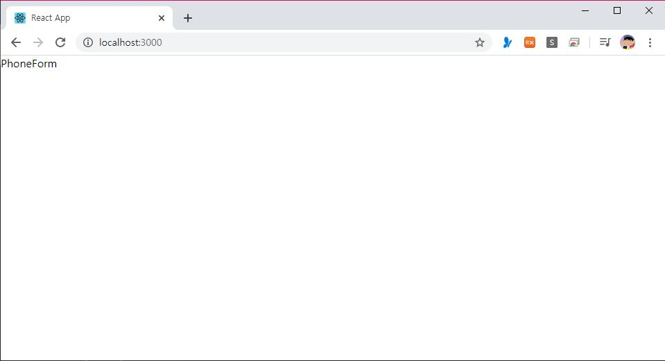
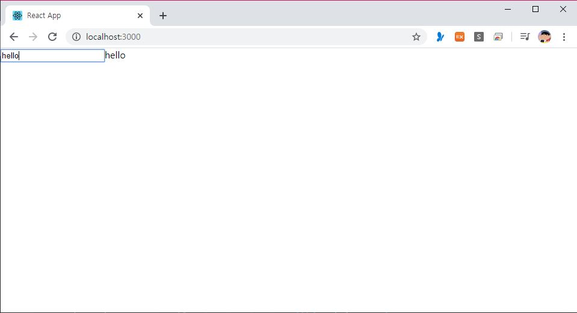
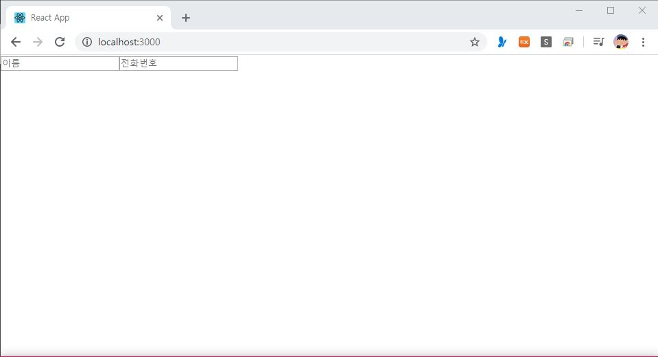
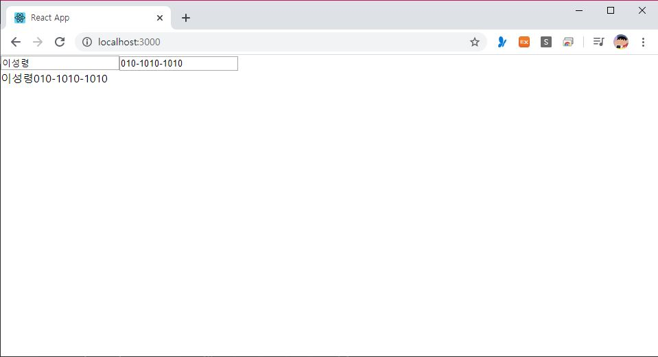

> 🎧 20.03.20 <br>
> 🧩 인프런 - 누구든지 하는 리액트: 초심자를 위한 react 핵심 강좌 ([https://www.inflearn.com/course/react-velopert](https://www.inflearn.com/course/react-velopert))


# Ch 7. 인풋 상태 관리

<br>

## <1> input 상태 관리하기

### 준비하기

PhoneForm 컴포넌트를 만들어 잘 적용되는지 확인해보기<br>
src 폴더 내에 components 디렉토리 하나 생성하고 그 안에 PhoneForm.js 작성<br><br>
```
import  React, { Component } from  'react';

class  PhoneForm  extends  Component {    
  render() {    
    return (
      <div>
        PhoneForm
      </div>
    );
  }
}    

export  default  PhoneForm;
```
↑ PhoneForm.js <br>
```
import  React, { Component } from  'react';
import  PhoneForm  from  './components/PhoneForm';

class  App  extends  Component {
  render() {
    return (
      <div>
        <PhoneForm  />
      </div>
    );
  }
}

export  default  App;
```
↑ App.js <br>
<br>
↑ 결과물<br><br>

<br>

### 내부에 input을 넣어보자

내부에 input을 생성하고 이 상태를 어떻게 관리할까?<br><br>

```
import  React, { Component } from  'react';

class  PhoneForm  extends  Component {    

  state = {
    name:  '',
  }

  handleChange = (e) => {
    this.setState({
      name:  e.target.value
    });
  }
  
  render() {    
    return (
      <form>
        <input  onChange={this.handleChange}  value={this.state.name}  />
        {this.state.name}
      </form>
    );
  }
}    

export  default  PhoneForm;
```
↑ PhoneForm.js <br>
`state` : 상태를 정의<br>
`handleChange` : input에서 변경 이벤트가 발생될 때 처리할 함수 생성. 여기서 `e`를 파라미터로 받아옴<br>
`e` : 이벤트 객체. 앞으로 어떻게 수정할건지 알 수 있음<br>
`e.target` : 이벤트 타겟 = input<br>
`this.setState({name: e.target.value});` : 어떻게 바뀔건지<br>
`<input onChange={this.handleChange} />` : input에서 값이 변경될 때 마다 name값이 바뀜<br>
<br>

<br>
↑ 결과물<br>
input안에 텍스트를 입력하는 대로 오른쪽에 같이 출력됨<br><br>

### input을 여러개 넣어보자

이름을 담을 input 이외로 전화번호를 넣을 input을 추가해봄<br>

```
      <form>
        <input
          placeholder="이름"
          onChange={this.handleChange}
          value={this.state.name}  
        />
        <input
          placeholder="전화번호" 
        />
      </form>
```
↑ PhoneForm.js <br>
`placeholder` : 아무것도 입력하지 않았을 때 기본적으로 보여줄 값<br>
<br>
<br>
↑ 결과물<br><br>

현재 전화번호가 담길 input은 handleChange의 영향을 받지 않고 있음<br>
input 두개가 모두 영향을 받기 위해서는?<br>

```
import  React, { Component } from  'react';

class  PhoneForm  extends  Component {    

  state = {
    name:  '',
    phone:  '',
  }

  handleChange = (e) => {
    this.setState({
      [e.target.name]:  e.target.value
    });
  }
  
  render() {
    return (
      <form>
        <input
          name="name"
          placeholder="이름"
          onChange={this.handleChange}
          value={this.state.name}
        />
        <input
          name="phone"
          placeholder="전화번호"
          onChange={this.handleChange}
          value={this.state.phone}
        />
        <div>
          {this.state.name}
          {this.state.phone}
        </div>
      </form>
    );
  }
}    

export  default  PhoneForm;
```
↑ PhoneForm.js <br>
state 안에 phone을 추가해 `value={this.state.phone}`을 받아줌<br>
onChange를 받기 위해서는 각 input이 name 값을 가져야 함<br>
그리고 그 뒤 handleChanged 안에서 단순히 `name: e.target.value` 로 받아주던 것을 `[e.target.name]:  e.target.value` 로 이름과 전화번호 모두 나타낼 수 있도록 표기 함<br>
<br>

<br>
↑ 결과물<br>
input안에 텍스트를 입력하는 대로 아래쪽에 같이 출력됨<br><br>
