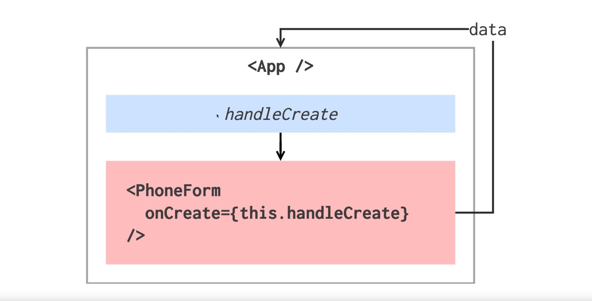
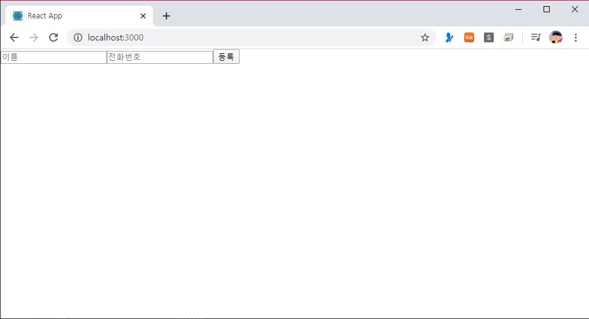
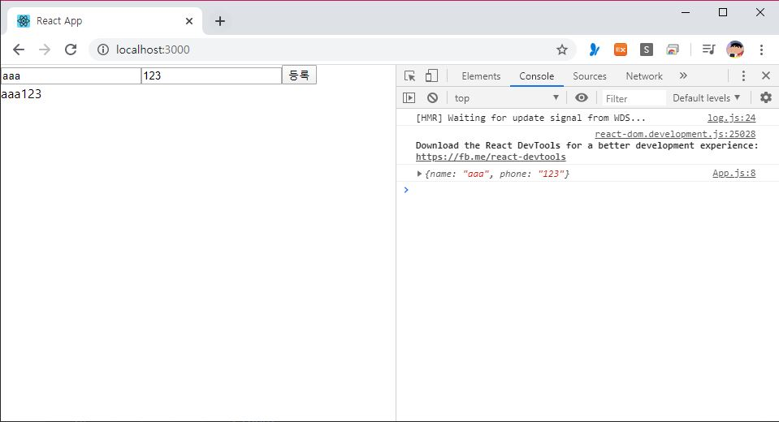

> 🎧 20.03.20 <br>
> 🧩 인프런 - 누구든지 하는 리액트: 초심자를 위한 react 핵심 강좌 ([https://www.inflearn.com/course/react-velopert](https://www.inflearn.com/course/react-velopert))


# Ch 8. 배열 데이터 렌더링 및 관리

<br>

## <1> 배열에 데이터 삽입하기

자식 컴포넌트가 부모한테 값을 전달하는 방법에 대해서 알아보자<br><br>

### 이론

<br><br>
App 컴포넌트 내부에서 handleCreate 메소드를 만들어 그 메소드를 자식 컴포넌트한테 props로 전달해주고 props로 전달한 함수를 호출시켜 데이터 값을 App한테 들어가도록 작성<br><br><br>


### 코드로 작성

앞서 ch7과 코드가 이어짐<br><br>
```
import  React, { Component } from  'react';
import  PhoneForm  from  './components/PhoneForm';

class  App  extends  Component {

  handleCreate = (data) => {
    /* 데이터를 파라미터로 가져옴 */
    console.log(data);
  }

  render() {
    return (
      <div>
        <PhoneForm  onCreate = {this.handleCreate}  />
        {/* 위의handleCreate를 PhonForm에 전달 */}
      </div>
    );
  }
}

export  default  App;
```
↑ App.js <br>
`handleCreate` 생성하고 PhoneForm에 전달<br><br>
```
import  React, { Component } from  'react';

class  PhoneForm  extends  Component {    

  state = {
    name:  '',
    phone:  '',
  }

  handleChange = (e) => {
    this.setState({
      [e.target.name]:  e.target.value
    });
  }
  
  handleSubmit = (e) => {
    e.preventDefault();
  }
  
  render() {
    return (
      <form onSubmit={this.handleSubmit}>
        <input
          name="name"
          placeholder="이름"
          onChange={this.handleChange}
          value={this.state.name}
        />
        <input
          name="phone"
          placeholder="전화번호"
          onChange={this.handleChange}
          value={this.state.phone}
        />
        <button  type = "submit">등록</button>
        <div>
          {this.state.name}
          {this.state.phone}
        </div>
      </form>
    );
  }
}    

export  default  PhoneForm;
```
↑ PhoneForm.js <br><br>
`<button  type = "submit">등록</button>` : input 옆에 제출 버튼 추가 <br>
`<form onSubmit={this.handleSubmit}>` : html 속성 상 submit 제출을 누르면 자동으로 새로고침이 됨. 우린 이게 필요 없기 때문에 `handleSubmit` 함수를 생성하고 원래 해야 할 작업을 하지 않는 `e.preventDefault();`를 넣어 방지함<br><br>

<br>
↑ 결과물<br><br><br>


props로 받았던 onCreate 함수를 호출<br>
여기에 name값과 phone을 들고옴<br><br>


```
  handleSubmit = (e) => {
    e.preventDefault();
    this.props.onCreate(this.state);
  }

```
↑ PhoneForm.js <br><br>

<br>
↑ 결과물<br>
console을 열어 확인한 결과 입력한 데이터가 name값과 phone값이 제대로 나타남
<br><br>


(~3:32)


<br><br><br>

## <2> 배열 렌더링하기

<br><br><br>

## <3> 배열에서 데이터 제거하기

<br><br><br>

## <4> 배열 안의 데이터 수정하기


