> 🎧 20.03.20 <br>
> 🧩 인프런 - 누구든지 하는 리액트: 초심자를 위한 react 핵심 강좌 ([https://www.inflearn.com/course/react-velopert](https://www.inflearn.com/course/react-velopert))


# Ch 8. 배열 데이터 렌더링 및 관리

<br>

## <1> 배열에 데이터 삽입하기

자식 컴포넌트가 부모한테 값을 전달하는 방법에 대해서 알아보자<br><br>

### 이론

<br><br>
App 컴포넌트 내부에서 handleCreate 메소드를 만들어 그 메소드를 자식 컴포넌트한테 props로 전달해주고 props로 전달한 함수를 호출시켜 데이터 값을 App한테 들어가도록 작성<br><br><br>


### 코드로 작성

앞서 ch7과 코드가 이어짐<br><br>
```javascript
import  React, { Component } from  'react';
import  PhoneForm  from  './components/PhoneForm';

class  App  extends  Component {

  handleCreate = (data) => {
    /* 데이터를 파라미터로 가져옴 */
    console.log(data);
  }

  render() {
    return (
      <div>
        <PhoneForm  onCreate = {this.handleCreate}  />
        {/* 위의handleCreate를 PhonForm에 전달 */}
      </div>
    );
  }
}

export  default  App;
```
↑ App.js <br>
`handleCreate` 생성하고 PhoneForm에 전달<br><br>

```javascript
import  React, { Component } from  'react';

class  PhoneForm  extends  Component {    

  state = {
    name:  '',
    phone:  '',
  }

  handleChange = (e) => {
    this.setState({
      [e.target.name]:  e.target.value
    });
  }
  
  handleSubmit = (e) => {
    e.preventDefault();
  }
  
  render() {
    return (
      <form onSubmit={this.handleSubmit}>
        <input
          name="name"
          placeholder="이름"
          onChange={this.handleChange}
          value={this.state.name}
        />
        <input
          name="phone"
          placeholder="전화번호"
          onChange={this.handleChange}
          value={this.state.phone}
        />
        <button  type = "submit">등록</button>
        <div>
          {this.state.name}
          {this.state.phone}
        </div>
      </form>
    );
  }
}    

export  default  PhoneForm;
```
↑ PhoneForm.js <br><br>
`<button  type = "submit">등록</button>` : input 옆에 제출 버튼 추가 <br>
`<form onSubmit={this.handleSubmit}>` : html 속성 상 submit 제출을 누르면 자동으로 새로고침이 됨. 우린 이게 필요 없기 때문에 `handleSubmit` 함수를 생성하고 원래 해야 할 작업을 하지 않는 `e.preventDefault();`를 넣어 방지함<br><br>

<br>
↑ 결과물<br>
<br><br><br>


props로 받았던 onCreate 함수를 호출<br>
여기에 name값과 phone을 들고옴<br><br>


```javascript
  handleSubmit = (e) => {
    e.preventDefault();
    this.props.onCreate(this.state);
  }
```
↑ PhoneForm.js <br><br>

<br>
↑ 결과물<br>
console을 열어 확인한 결과 입력한 데이터가 name값과 phone값이 제대로 나타남<br>
<br><br><br>


이제 App.js가 받은 data를 어떻게 할까?<br>
새로운 배열 `information`을 만들어서 data를 넣고 기존에 있던 배열 자리에 넣어줌<br><br>

```javascript
class  App  extends  Component {

  state = {
    information: [],
  }

  handleCreate = (data) => {
    this.setState({
      information:  this.state.information.concat(data)
    })
  }

render() {
    return (
      <div>
        <PhoneForm  onCreate = {this.handleCreate}  />
        {JSON.stringify(this.state.information)}
      </div>
    );
  }
}

export  default  App;
```
↑ App.js <br>
<br>
리액트에서는 불변성을 꼭 유지해야 해서 어떠한 값을 수정할 때 setState를 이용해야하고, 그 내부에 있는 배열이나 객체를 바꿀 때에는 기존 배열이나 객체는 수정하지 않고 그것을 기반으로 새로운 객체 혹은 배열을 만들어 값을 주입해야 함<br><br>
그러므로 데이터를 넣을 때 단순히 push를 사용하는 것이 아닌 배열 내장 함수 `concat`을 이용<br><br>

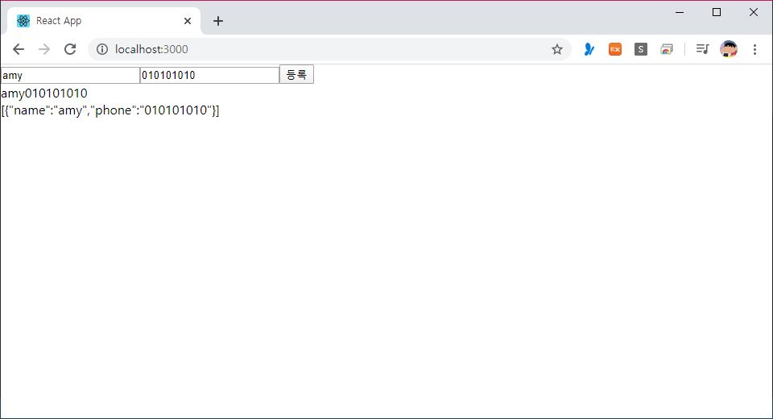<br>
↑ 결과물<br>
`information` 값을 문자열 형태로 변환해서 화면에 출력. 잘 넣어졌는지 확인<br>
<br><br><br>


handleCreate를 조금만 더 간편하게 작성<br>
=> 비구조 할당법 <br>
```javascript
  handleCreate = (data) => {
    const { information } = this.state;
    this.setState({
      information: information.concat(data)
    });
  }
```
↑ App.js <br>
<br><br><br>


PhoneForm 컴포넌트에서 새로 등록을 할 때 기존에 있던 input 값을 초기화하도록<br>
```javascript
  handleSubmit = (e) => {
    e.preventDefault();
    this.props.onCreate(this.state);
    this.setState({
      name:  '',
      phone:  '',
    })
  }
```
↑ PhoneForm.js <br>
<br><br><br>


데이터를 추가할 때 마다 각 데이터의 고유한 id 값이 들어가지게 만들기<br>
```javascript
class  App  extends  Component {

  id = 0;

  state = {
    information: [],
  }

  handleCreate = (data) => {
    const { information} = this.state;
    this.setState({
      information:  information.concat({
        ...data,
        id:  this.id++
      })
    });
  }
```
↑ App.js <br>
id 변수를 새로 할당해주고 함께 concat(덧붙이기)<br>
<br><br>
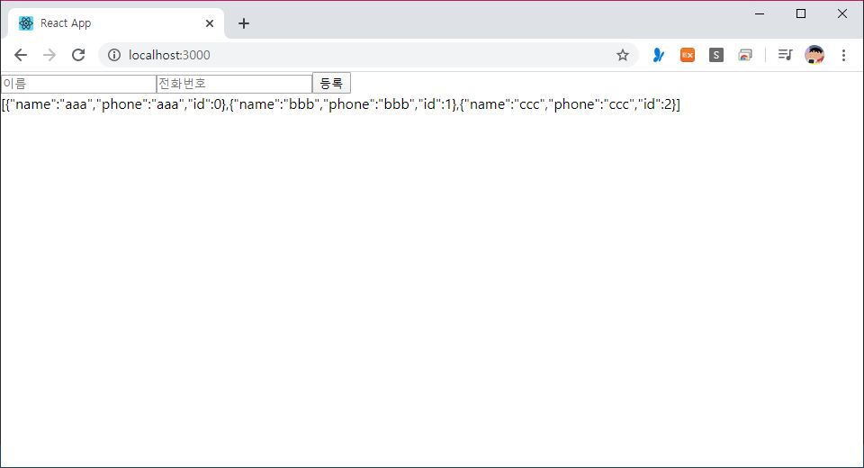<br>
↑ 결과물<br>
등록을 누를때 마다 데이터가 저장되면서 동시에 id값도 각각 다르게 부여함<br>
<br><br>


<br><br>

## <2> 배열 렌더링하기

JS 배열 내장함수 **map**<br>
배열을 특정 함수를 사용하여 전체적으로 변환해주고 싶을 때 사용<br><br><br>


### .map
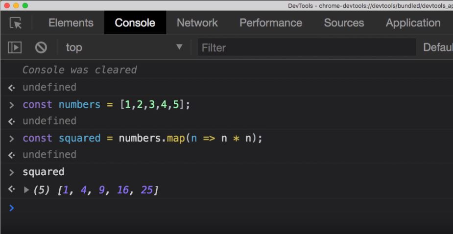<br>
`numbers.map(n => n*n)` : numbers 내부에 있는 n을 이용해 결과값은 n*n으로 하겠다는 함수<br><br>


### 실습

각 전화번호 정보를 보여줄 PhoneInfo.js 와<br> PhoneInfoList.js 를 components 폴더 안에 새로 생성<br>

```javascript
import  React, { Component } from  'react';

class  PhoneInfo  extends  Component {
  render() {
    const { name, phone } = this.props.info;

    const  style = {
      border:  '1px solid black',
      padding:  '8px',
      margin:  '8px',
    };

    return (
      <div  style={style}>
        <div><b>{name}</b></div>
        <div>{phone}</div>
      </div>
    );
  }
}

export  default  PhoneInfo;
```
↑ PhoneInfo.js <br><br>


```javascript
import  React, { Component } from  'react';
import  PhoneInfo  from  './PhoneInfo';

class  PhoneInfoList  extends  Component {

  static  defaultProps = {
    data: []
  }
  
  render() {
    const { data } = this.props;

    const  list = data.map(
      info  => (<PhoneInfo  info={info}  key={info.id}  />)
    );

    return (
      <div>
        {list}
      </div>
    );
  }
}

export  default  PhoneInfoList;
```
↑ PhoneInfoList.js <br><br>

**key** 값은 컴포넌트를 여러개 렌더링할 때 고유값을 부여해줌으로써 나중에 업데이트 성능을 최적화 해줌<br><br>

`info => (<PhoneInfo info={info} key={info.id}  />)` : 앞에서 숫자로 이루어진 배열을 가지고 제곱을 해줬다면 이번에는 info들의 배열을 가지고 PhoneInfo 컴포넌트로 변환한 것<br>
<br>

```javascript
import  React, { Component } from  'react';
import  PhoneForm  from  './components/PhoneForm';
import  PhoneInfoList  from  './components/PhoneInfoList';

...


  render() {
    return (
      <div>
        <PhoneForm  onCreate = {this.handleCreate}  />
        <PhoneInfoList  data = {this.state.information}/>
      </div>
    );
  }
```
↑ App.js <br>
PhoneInfoList.js 연결하고 거기에 information 값을 전달해줌<br><br>

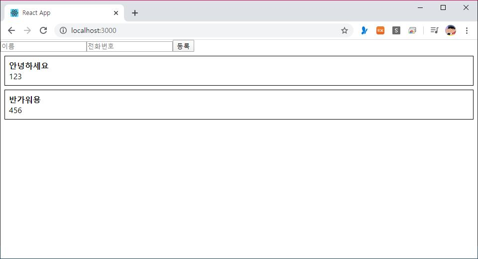<br>
↑ 결과물<br>
등록을 누를때 마다 추가됨<br>
<br><br>


### 배열 렌더링, key

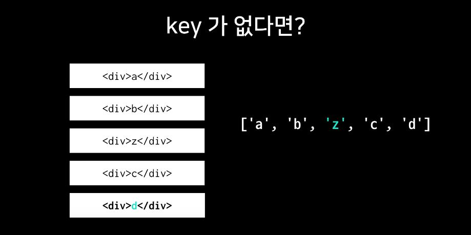<br>
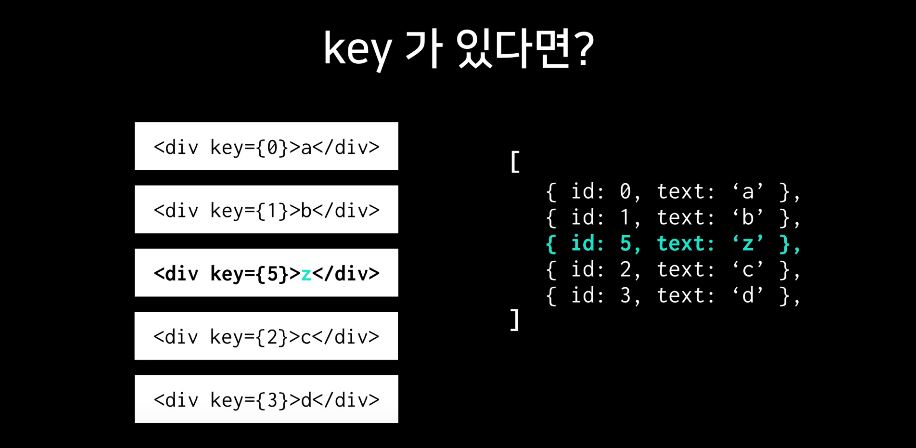<br>

**key**는 react에서 내부적으로 무언가를 제거하거나 추가할 때 효율적으로 사용되는 값<br>

만약 위의 예제에서 key값을 넣어주지 않으면 자동으로 배열의 index 값이 key 값으로 사용되어 렌더링이 되지만 id값에는 이상이 생김<br>
<br><br>

<br><br>

## <3> 배열에서 데이터 제거하기

데이터의 불변성을 유지하면서 제거하기 위해서는 JS의 내장함수 **.slice** 혹은 **.filter** 를 사용<br><br><br>

### .slice
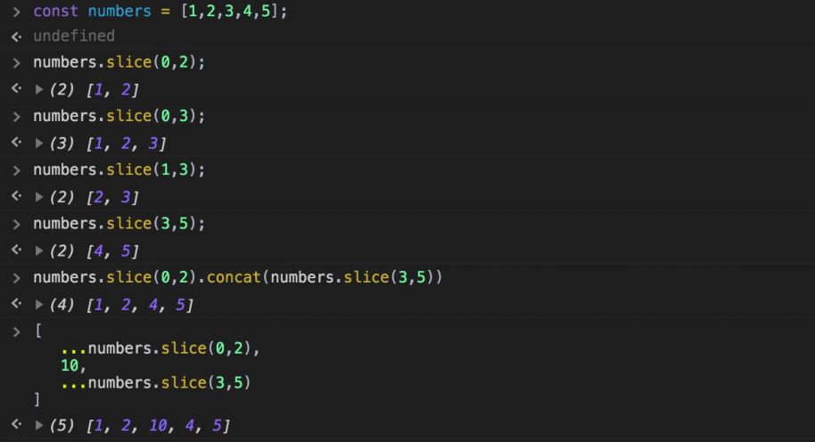<br>
배열을 잘라주는 것<br><br>


### .filter
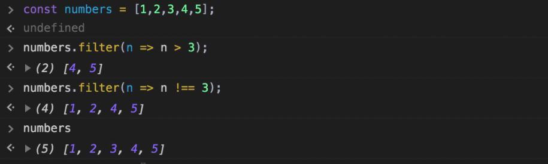<br>
배열을 필터링 하는 것<br>
기존의 배열을 건드리는 것이 아니기 때문에 불변성을 지켜 더 간편<br><br>


### 실습

App 컴포넌트에 현재 information 안에 들어 있는 info의 id가 변수로 받은 id가 아닌 것은 제거하도록 하는 `handleRemove` 함수 추가


```javascript
  handleRemove = (id) => {
    const { information } = this.state;
    this.setState({
      information:  information.filter(info  =>  info.id !== id)
    });
  }

  render() {
    return (
      <div>
        <PhoneForm  onCreate = {this.handleCreate}  />
        <PhoneInfoList
          data = {this.state.information}
          onRemove={this.handleRemove}
        />
      </div>
    );
  }
```
↑ App.js <br>
id 값을 변수로 들고와 information을 필터링하는 `handleRemove` 함수 추가하고<br>
`onRemove`를 이용해 PhoneInfoList에 전달<br><br>

```javascript
    const { data, onRemove } = this.props;

    const  list = data.map(
      info  => (
        <PhoneInfo
        onRemove={onRemove}
        info={info}
        key={info.id}
        />
      )
    );
```
↑ PhoneInfoList.js <br>
props로 받은 `onRemove`를 PhoneInfo로 전달<br><br>

```javascript
  handleRemove = () => {
    const {info, onRemove} = this.props;
    onRemove(info.id);
  }
  
  render() {

  ..
  ...
  ..

  return (
    <div  style={style}>
      <div><b>{name}</b></div>
      <div>{phone}</div>
      <button  onClick={this.handleRemove}>삭제</button>
    </div>
  );
```
↑ PhoneInfo.js <br>
`handleRemove` 함수를 구현해서 이 값을 삭제 버튼에 연결<br><br>

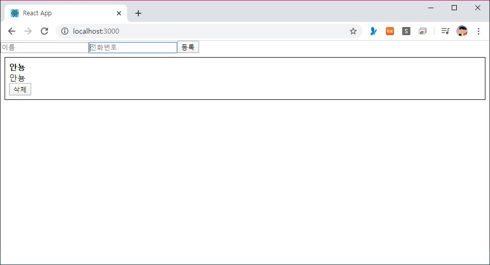<br>
↑ 결과물<br>
삭제를 누르면 등록된 목록이 사라짐<br>
<br><br>


<br><br>

## <4> 배열 안의 데이터 수정하기

데이터를 수정할 때에는 앞서 배웠던 JS의 내장함수 **.slice** 혹은 **.map** 을 사용<br><br><br>

### .slice
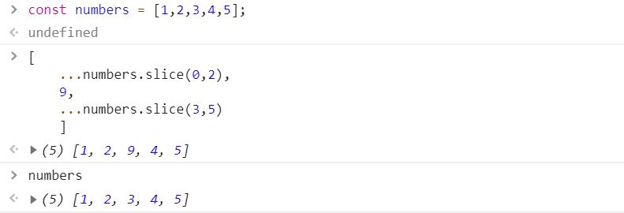<br>
배열 자르기의 응용<br><br>


### .map
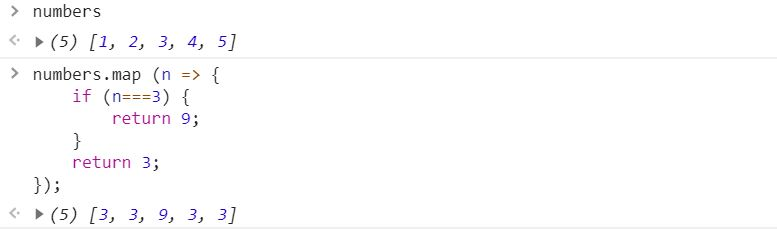<br>
배열 렌더링 하기의 응용<br><br>


### 실습

App 컴포넌트에 현재 information 안에 들어 있는 info의 id가 변수로 받은 id가 일치하면 id과 name, phone값을 리턴해주는 `handleUpdate` 함수 추가<br>

```javascript
  handleUpdate = (id, data) => {
    const { information } = this.state
    this.setState({
      information:  information.map(
        info  => {
          if (info.id === id) {
            return {
              id,
              ...data, /* name과 phone값이 들어가도록 */
            };
          }
          return  info;
        }
      )
    });
  }

  render() {
    return (
      <div>
          ..
          ...
          onUpdate = {this.handleUpdate}
        />
      </div>
    );
  }
```
↑ App.js <br>
id 값과 어떻게 바꿀지 두 가지를 변수로 들고와 information을 수정하는 `handleUpdate` 함수 추가하고<br>
`onUpdate`를 이용해 PhoneInfoList에 전달<br><br>

```javascript
    const { data, onRemove, onUpdate } = this.props;

    const  list = data.map(
      info  => (
        <PhoneInfo
        onRemove={onRemove}
        onUpdate={onUpdate}
        info={info}
        key={info.id}
        />
      )
    );
```
↑ PhoneInfoList.js <br>

<br><br>

```javascript
import React, { Component, Fragment } from 'react';

class PhoneInfo extends Componet {

  state = {
    editing: false,
  }
  
  handleRemove = () => {
    const {info, onRemove} = this.props;
    onRemove(info.id);
  }

  handleToggleEdit = () => {
    this.setState({
      editing: !this.state.editing,
    }) 
  }
  
  render() {
    const { name, phone } = this.props.info;
    const { editing } = this.state;

    const  style = {
      border:  '1px solid black',
      padding:  '8px',
      margin:  '8px',
    };

  return (
    <div  style={style}>
      {
        editing ? ( 
          <Fragment>
            <div><input /></div>
            <div><input /></div>
          </Fragment>
        ) : (
          <Fragment>
            <div><b>{name}</b></div>
            <div>{phone}</div>
          </Fragment>
        )
      }
      <button  onClick={this.handleRemove}>삭제</button>
      <button  onClick={this.handleToggleEdit}>
        { editing ? '적용' : '수정' }
      </button>
    </div>
  );
```
↑ PhoneInfo.js <br>
true면 false로, false면 true로 결과를 반전시켜주는 `handleToggleEdit` 이용<br>
editing 값이 만약 true이면 수정할 텍스트를 넣을 Fragment (전자)를 보여주고, false이면 (기존에 보여주던) 이름과 번호 결과물 Fragment (후자)를 보여줌<br><br>

그리고 수정할 텍스트를 넣고나서는 '수정' 버튼이 아닌 '적용'버튼으로 띄워지도록 삼항연산자를 이용해 변경<br>

<br><br><br>


하지만 이렇게 만들면 적용 버튼을 눌러도 새로 수정한 텍스트가 반영되지 않음.<br>
이를 위해서는 props로 가지고 있던 값이 input의 값으로 들어가지도록 해야함<br>
=> state에서 input의 관리를 해줘야 함!<br><br>

```javascript
  state = {
    editing: false,
    name: ''.
    phone: ''
  }

  ..
  ...
  ..

  handleToggleEdit = () => {
    // true -> false
      // onUpdate
    // false -> true
      // state에 info 값들 넣어주기
    const { info, onUpdate } = this.props;
    if (this.state.editing) {
      onUpdate(info.id, {
        name: this.state.name,
        phone: this.state.phone
      });
    } else {
	  this.setState({
        name: info.name,
        phone: info,phone
      });
    }
  }
  
  handleChange = (e) => {
    this.setState({
      [e.target.name]: e.target.value
    })
  }
  
  ..
  ...
  ..
         <Fragment>
            <div>
              <input 
                name="name"
                onChange={this.handleChange}
                value={this.state.name}
                />
            </div>
            <div>
              <input 
                phone="phone"
                onChange={this.handleChange}
                value={this.state.phone}
              />
            </div>
          </Fragment>
  
```
↑ PhoneInfo.js <br>
state 쪽에 name값이랑 phone값을 넣어주고 `handleChange` 를 구현한 뒤, input에 연결<br><br>

그리고 수정버튼을 눌렀을 때 input에 빈 공간이 아닌 원래의 값이 미리 작성되어있도록 수정해주기 위해서 `handToggleEdit` 안에 로직을 작성<br>
(1) editing 값이 true에서 false로 전환될 때는 , 원래 전달 받았던 `onUpdate` 를 이용해 우리가 업데이트 하겠다를 알리도록 하고<br>
(2) editing 값이 false에서 true로 전활될 때는, props로 받아왔던 info안에 있는 name과 phone값을 state 쪽으로 넣어주는 작업을 함<br><br>
<br>

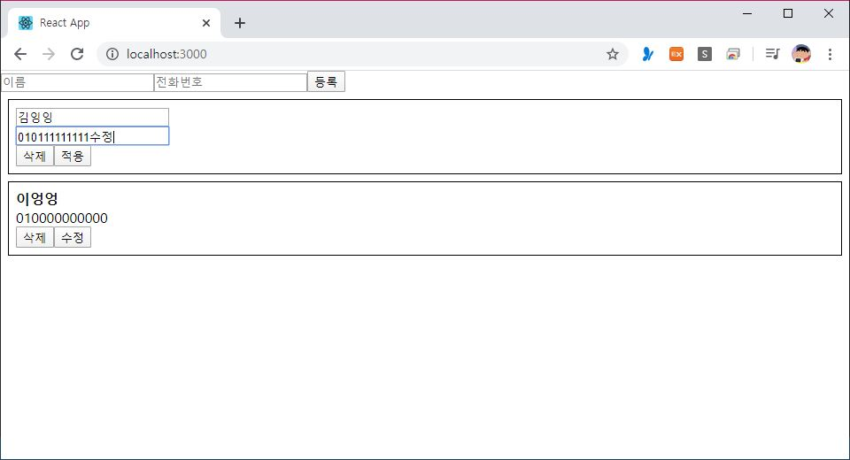<br>
↑ 결과물<br>
<br><br>
