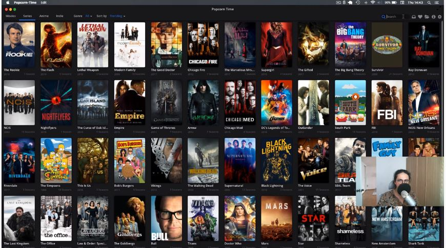
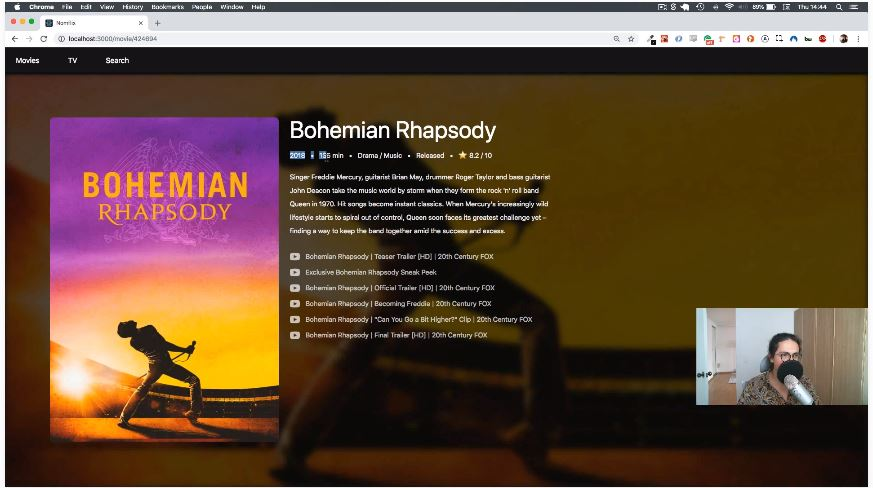

> 🎧 20.04.24  
> 🧩 노마드코더 - 초보를 위한 React JS ([https://academy.nomadcoders.co/courses/enrolled/436641](https://academy.nomadcoders.co/courses/enrolled/436641))

# Ch 0. Introduction

 

## <0> Introduction

프로젝트를 진행하면서 배우게 될 것
- React Router
- Style Component
- Github

## <1> What are we building

 
 

**Popcorn-Time**
- 맥/윈도우 앱
- 온라인으로 영화를 볼 수 있음
- 100% React
- Movies / TV / Search
- 커버 이미지 / 배경 이미지/ 개봉(방영)년도 / 러닝타임 / 장르 / 별점 / 줄거리

