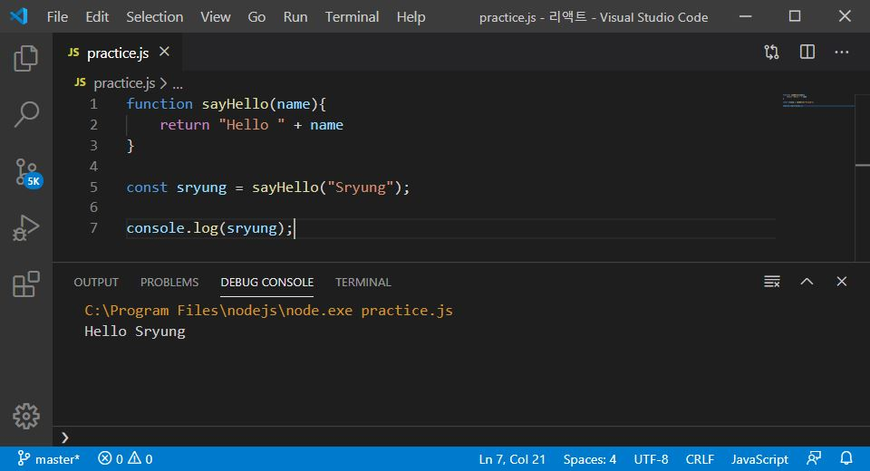

> 🎧 20.04.24 <br>
> 🧩 노마드코더 - 초보를 위한 React JS ([https://academy.nomadcoders.co/courses/enrolled/436641](https://academy.nomadcoders.co/courses/enrolled/436641))

# Ch 1. Fundamentals

<br>

react 수업을 시작하기 전 반드시 알아야 하는 것들을 알아보자.<br>
JS의 기초가 되는 부분을 이해하고 갈 것<br>

<br>

## <1> Arrow Functions


**Arrow Function (화살표 함수)**<br>
```javascript
function sayHello(name){
	return "Hello " + name
}

const sryung = sayHello("Sryung");

console.log(sryung);
```
<br>
sayHello라는 함수는 name을 파라미터로 받고 "Hello "와 name을 합쳐서 반환함<br>
그 결과 콘솔창에는 *Hello Sryung*이 띄워짐<br>
<br>
<br>
```javascript
function sayHello(name){
	"Hello " + name
}
```
만약 sayHello 함수가 아무것도 return하지 않는다면 (return을 지운다면)<br>
*Hello Sryung*이 아닌 *undefined*가 띄워짐<br>
<br>
대신에<br>
```javascript
const sayHello = (name) => "Hello " + name;
```
기본적으로 화살표함수는 return이 함축되어 있기 때문에 function을 대신해 위와 같이 표기해도 원하는 결과가 출력됨<br>
<br>
<br>
```javascript
function sayHello(name = "Sryung"){
	return "Hello " + name
}

const sryung = sayHello();

console.log(sryung);
```
그리고 "Sryung"을 function에 넣어 default 값으로 설정할 수도 있음<br>
```javascript
const sayHello = (name = "Sryung") => "Hello " + name;
```
이 경우에도 역시 화살표 함수로 표기할 수 있음<br>
<br>
<br>
아래는 다른 예시로,  버튼을 누르면 event를 console.log 하는 코드로 모두 같음<br>
```javascript
const button = document.querySelector("button");

const handleClick = event => console.log(event);

button.addEventListener("click", handleClick);
```
```javascript
const button = document.querySelector("button");

button.addEventListener("click", event => console.log(event));
```
```javascript
const button = document.querySelector("button");

button.addEventListener("click", function(event) {
	console.log(event);
});
```
<br>
<br>
<br>

**화살표 함수의 유일한 규칙**
> argument가 하나일 때는 괄호가 필요 없다

```javascript
button.addEventListener("click", {event, something} => console.log(event));
```
argument가 두 개(event와 something)일 경우, 위와 같이 표기<br>

<br><br><br>

## <2> Template Literals


**Template Literals** <br>
Template, Variable, String들 다루기 가장 좋은 방법<br>

```javascript
const sayHello = (name = "Sryung") => "Hello " + name;
```
```javascript
const sayHello = (name = "Sryung") => `Hello ${name}`;
```
``(backticks) 를 이용해 텍스트 전체를 감싸고<br>
+연산을 이용해 끊어 표현하지 않고, 문장 내에 바꿀 부분만 골라냄<br>
  
<br><br><br>

## <3> Object Destructuring


**Destructuring**<br>
일일히 값을 넣지 않고 한 줄로 한번에 넣을 수 있음<br>
```javascript
const human = {
	name: "Ryung",
	lastName: "Lee",
	nationality: "I'm hungry"
	favFood: {
		braekfast: "Toast",
		lunch: "Noodle"
		dinner: "Chicken"
	}
}

// const name = human.name;
// const lastName = human.lastName;
// const difName = human.nationality;
// const dinner = human.favFood.dinner;
// const breakfast = human.favFood.breakfast;

const { name, lastName, nationality:difName, favFood:{dinner, breakfast} } = human;

console.log(name, lastName, difName, dinner, breakfast);
```
주석 처리 된 것이 Structuring, 아래부분이 Destructuring<br>
<br>
(1) 풀이하자면 human이라는 object로 가서 name의 값을 새로운 변수인 name에 넣고, lastName의 값을 새로운 변수 lastName에 넣는 것<br><br>

(2) 그리고 만약 새 변수 이름을 이전 human 안에 있는 이름 그대로 들고오고 싶지 않을 때는 nationality의 예시와 같이 `원래이름:바꿀이름` 으로 들고올 수 있음<br><br>

(3) 단,  `:` 이후 중괄호가 들어가면 favFood의 예시와 같이 `object이름:{object 안에서 꺼내올 것의 이름}` 으로 아예 용도가 달라지므로 주의<br><br>

결과적으로 *Ryung Lee I'm hungry Chicken Toast* 출력<br>

<br><br><br>


## <4> Spread Operator


**Spread Operator**<br>
배열로부터 아이템을 가져와서 Unpack함<br>
```javascript
const days = ["Mon", "Tues", "Wed"];
const otherDays = ["Thu", "Fri", "Sat"];

const allDays1 = days + otherDays;
let allDays2 = [days + otherDays];
const allDays3 = [...days, ...otherDays];
const allDays4 = [...days, ...otherDays, "Sun"];

console.log(days); // ["Mon", "Tues", "Wed"]
console.log(otherDays); // ["Thu", "Fri", "Sat"]

console.log(allDays1); // Mon,Tues,WedThu,Fri,Sat
console.log(allDays2); // ["Mon,Tues,WedThu,Fri,Sat"]
console.log(allDays3); // ["Mon", "Tues", "Wed", "Thu", "Fri", "Sat"]
console.log(allDays4); // ["Mon", "Tues", "Wed", "Thu", "Fri", "Sat", "Sun"]
```
(1) `+`를 이용할 경우, 배열 days와 배열 otherDays 를 + 로 묶은  allDays는 배열이 아니고 String임<br>
<br>
(2) let을 이용할 경우, 오직 하나의 Item을 가진 배열이 됨<br>
<br>
(3) `...`을 배열 이름 앞에 붙임으로써 배열 내부의 콘텐츠들이 개별로 됨<br>
<br>
(4) 그리고 뒤에 이어서 콘텐츠를 추가 할 수 있음<br>
<br><br>

Sparead Operater는 Object에서도 작동<br>
```javascript
const ob = {
	first: "hi",
	secong: "hello"
}

const ab = {
	third: "bye bye"
}

const one = {ob, ab}; 
const two = {...ob, ...ab};

console.log(one); // Object {ob: Object, ab:Object}
console.log(two); // Object {first: "hi", second: "hello", third: "bye bye"} 
```
(1) 두 Object가 들어있는 하나의 Object가 탄생함<br>
(2) 두개의 Object의 콘텐츠를 가지게 됨<br>

<br><br>

Sparead Operater는 그 외에도 argument와  function에서도 작동하며 아주 유용함<br>

<br><br><br>


## <5> Classes

## <6> Array.map

## <7> Array.filter

## <8> .forEach .includes .push
