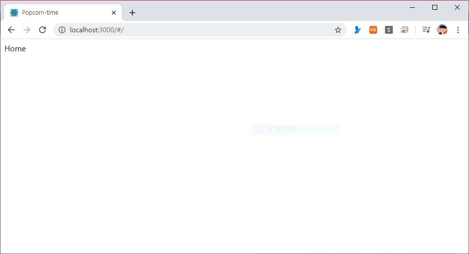
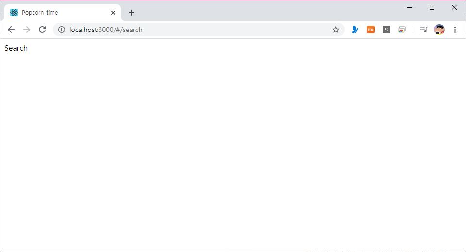
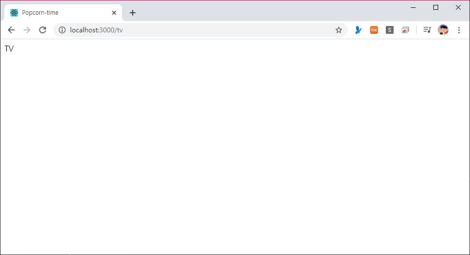
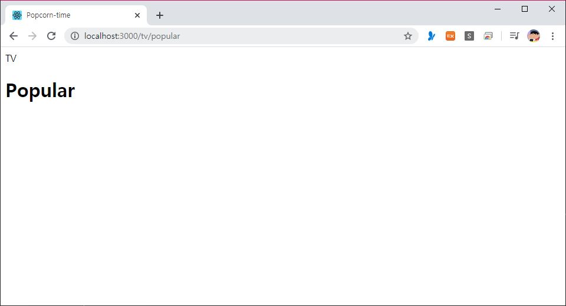
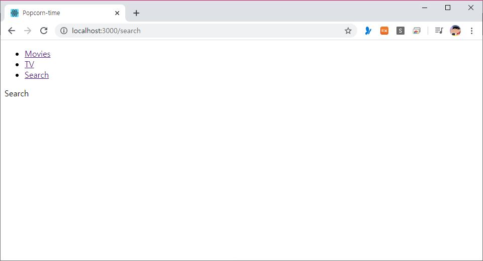

> 🎧 20.05.01 <br>
> 🧩 노마드코더 - 초보를 위한 React JS ([https://academy.nomadcoders.co/courses/enrolled/436641](https://academy.nomadcoders.co/courses/enrolled/436641))

# Ch 2. Project Setup

<br>

## <1> Setting Up the Project

**react 프로젝트 시작 준비**<br>

(1) 여태 배운 방법 복습<br>
`$ yarn global add create-react-app`<br>
`$ create-react-app 프로젝트명`<br>

<br>
(2) 자동 업데이트가 되지 않기 때문에 강의에서 더 추천하는 준비 방법<br>

`$ yarn global add npx`<br>
`$ npm i npx -g`<br>
`$ npx create-react-app 프로젝트명`<br>

<br><br>
**프로젝트 내에서 필요하지 않은 파일 삭제** (src 폴더 안)<br>

- App.css
- App.test.js
- index.css
- logo.svg
- serviceWorker.js
- setupTest.js

<br><br>
**코드 깔끔하게 정리**<br>

```javascript
import React from 'react';
import ReactDOM from "react-dom";
import App from "./App.js";

ReactDOM.render(<App />, document.getElementById("root"));
```
↑index.js<br>
```javascript
import React, { Component } from 'react';

class App extends Component {
	render(){
		return(
			<div className="App">
			</div>
		);
	}
}

export default App;
```
↑App.js<br>
```javascript
NODE_PATH=src
```
↑.env (src 폴더 바깥)<br>
기본적으로 src 파일을 보도록 함<br>

<br><br>

**prop-types 설치**<br>

`$ yarn add prop-types`<br>

<br>

**프로젝트 실행**<br>

`$ yarn start`<br>

<br><br><br>


## <2> React Router Part 1

<br>

**README 작성** <br>
```
# Popcorn-time

Learning React and ES6 by building a Movie Discovery App.

##  Screens
- [ ] Home
- [ ] TV Shows
- [ ] Search
- [ ] Detail
```
<br><br>

**ROUTE** <br>

src 폴더 내에 Componets 폴더와 Routes 폴더를 생성<br>
App.js는 Components 폴더 안으로 옮기고, Routes 폴더 안에는  Home.js, TV.js, Search.js, Detail.js 4개를 만듦<br>
<br>
```javascript
import React from 'react';
import ReactDOM from "react-dom";
import App from "Components/App.js";

ReactDOM.render(<App />, document.getElementById("root"));
```
↑ index.js<br>
```javascript
export  default () =>  "Home";
```
↑ Routes > Home.js<br>
```javascript
export  default () =>  "TV";
```
↑ Routes > TV.js<br>
```javascript
export  default () =>  "Search";
```
↑ Routes > Search.js<br>
```javascript
export  default () =>  "Detail";
```
↑ Routes > Detail.js<br>
<br><br>


React App에게 홈페이지가 Home에서 시작해야 한다는 걸 어떻게 알려줄까? 즉, Route를 어떻게 알려줄까?<br>
=> **Reacr Router** 사용<br>

<br>

### React Router
**react-router-dom** 설치<br>

`$ yarn add react-router-dom`<br>

<br>
Component 폴더 내에 Router.js 생성 <br>

```javascript
import React from "react";
import {HashRouter as Router, Route} from "react-router-dom";
import Home from "Routes/Home"

export default () => (
	<Router>
		<Route  path="/"  exact  component={Home}  />
	</Router>
);
```
↑ Components > Router.js<br>
**HashRouter** 이용<br>
`path="/"  exact` : 어느 URL에서 해당 Route를 render할 지 알려줌. "/"이 기본값(홈화면)<br>
`component={Home}` : 이 Route에 왔을 때 어떤 컴포넌트가 보여질 건지에 대해 지정<br> 
<br>

```javascript
import React, { Component } from 'react';
import Router from "Components/Router";

class App extends Component {
	render() {
		return(
			<>
				<Router />
			</>
		);
	}
}

export default App;
```
↑ Components > App.js<br>
Router를 연결<br>
<br>
<br>

**나머지 Route들도 만드는 방법은?**<br>
```javascript
...
import Home from "Routes/Home"
import TV from "Routes/TV"
import Search from "Routes/Search"

export default () => (
	<Router>
		<>
			<Route path="/" exact component={Home} />
			<Route path="/tv" component={TV} />
			<Route path="/search" component={Search} />
		</>
	</Router>
);
```
↑ App.js<br>
Router는 오직 하나의 child만 가진다는 규칙이 있어서 Route를 여러개 만들고 싶을 경우 `<></>`로 한 번 묶어줌<br>
홈화면 외에는 exact를 붙여주지 않아도 됨<br>

<br>
<br>
↑ 결과물<br>

<br><br><br>


## <3> React Router Part 2

**Hash Router vs Browser Router** <br>

위의 결과물 중 주소에 들어있는 **#** 은 뭘까? <br>
=> **Hash Router**의 Hash <br>
만약 거슬린다면 **Browser Router**를 이용<br>
```javascript
import {HashRouter as Router, Route} from "react-router-dom";
```
```javascript
import {BrowserRouter as Router, Route} from "react-router-dom";
```
↑ Router.js<br>
<br>
기능은 차이가 없으므로 본인 취향껏 고르기<br>

<br><br>

**Composition** <br>
두 개 이상의 Route를 동시에 렌더링 하는 방식<br><br>

예를 들어, tv 라는 Router를 가지고 있다. 그리고 tv가 여러 tab(ex. popular)을 가지고 있을 경우, path 뒤에 component를 쓰는 대신 render를 사용할 수 있음 <br>
```javascript
...
			<Route path="/" exact component={Home} />
			<Route path="/tv" component={TV} />
			<Route path="/tv/popular" render={() => <h1>Popular</h1>} />
```
위의 `"/tv"` 와 `"/tv/popular"`는 tv라는 경로가 겹치기 때문에<br>
popular 주소로 들어갈 경우, tv 주소에 있던 콘텐츠가 없어지지 않고 유지됨<br>
즉, 두개의 Route를 동시에 렌더링 함<br>
<br>
<br>
<br>
↑ 결과물<br>

<br><br>

이 원리는 **Header Render**로 유용하게 사용됨<br> 

<br><br>

**Header Render** <br>

Components 폴더 내에 Header.js 생성<br>

```javascript
import React from "react";

export default () => (
	<header>
		<ul>
			<li><a href="/">Movies</a></li>
			<li><a href="/tv">TV</a></li>
			<li><a href="/search">Search</a></li>
		</ul>
	</header>
)
```
↑ Header.js<br>
```javascript
...
import Router from "Components/Router";
import Header from "Components/Header";
..
...
..
				<Header />
				<Router />
...
```
↑ App.js<br>
<br>
↑ 결과물<br>
<br>
Router 바깥에 Header를 두었기에<br>
이제 모든 곳에서 메url 이동이 가능한 Header가 나타남<br>

<br><br>

**Redirect와 Switch**<br>
```javascript
import React from "react";
import {BrowserRouter as Router, Route, Redirect, Switch} from "react-router-dom";
import Home from "Routes/Home"
import TV from "Routes/TV"
import Search from "Routes/Search"

export default () => (
	<Router>
		<Switch>
			<Route path="/" exact component={Home} />
			<Route path="/tv" exact component={TV} />
			<Route path="/tv/popular" render={() => <h1>Popular</h1>} />
			<Route path="/search" component={Search} />
			<Redirect from="*" to="/" />
		</Switch>
	</Router>
);
```
↑ Router.js<br>
<br>
메인 주소 뒤에 지정되지 않은 이상한 주소를 입력할 경우 홈화면(`"/"`)을 띄워주도록 이용하는 것이 **Redirect**<br>
하지만 `"/"` 는 모든 Route의 path에 들어가있기 때문에 즉, 다수의 Route가 동시에 렌더링되는 것<br>
따라서 Redirect만 집어넣을 경우 Header 속 메뉴들을 누르면 모두 Home으로만 들어가짐<br>
<br>
이를 위해 적용되는 것이 **Switch**<br>
한번에 오직 하나의 Route가 렌더링 되도록 설정<br>
대신 `"/tv"`와 `"/tv/popular"`는 두 개 렌더링이 가능해야하기 때문에  TV Route에 **exact**를 붙여줌<br> (정확히 그 경로로 가겠다는 의미)<br>

<br><br><br>

`/tv/popular`는 다양한 이해를 위해서 추가한 것이고 프로젝트에는 필요 없으므로<br>
ch3에서는 해당 부분 삭제해서 진행<br>
