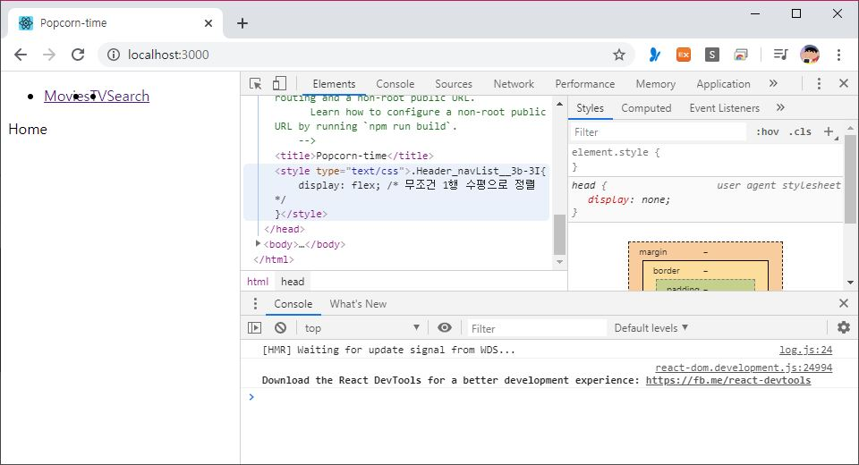
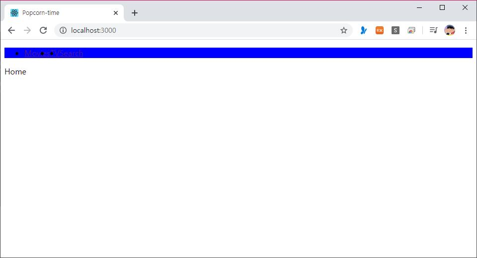

> 🎧 20.05.01 <br>
> 🧩 노마드코더 - 초보를 위한 React JS ([https://academy.nomadcoders.co/courses/enrolled/436641](https://academy.nomadcoders.co/courses/enrolled/436641))

# Ch 3. Styles

<br>

## <1> CSS in React Part 1

**css 연결하는 방법 (1)** <br>
src 폴더 내에 style.css 파일 생성<br>
그리고 index.js에서 import 해주면 연동 완료<br>
```javascript
import "style.css";
```
↑ index.js<br>
<br>


```css
.nav ul{
	display: flex; /* 무조건 1행 수평으로 정렬 */
}
```
↑ style.css <br>
 
```css
	<header className="nav">
```
↑ Components > Header.js <br>
<br>
↑ 결과물<br>

<br><br>


**css 연결하는 방법 (2)** <br>
(1)의 방법은 css 속성을 한 파일로 정리하는 것<br>
만약 프로젝트가 커지면 css 파일을 여러 파일로 분리하는 것이 더 편할 것<br><br>

Components 폴더 내에 Header라는 폴더를 생성<br>
Header 폴더 내에 index.js를 새로 만들고 Header.js를 끌어옴<br>
```javascript
import Header from "./Header";

export default Header;
```
↑ Components > Header > index.js <br>
`export default Header`를 해주는 이유는 이전에Components > App.js에서 해준 `import Header from "Components/Header"`를 변경하지 않고 유지하고 싶기 때문<br>
<br>
```javascript
import "./Header.css";
```
↑ Components > Header > Header.js<br>

(1)에서 만든 style.css도 Header.css로 이름 설정 후 Components>Header 폴더 내로 이동<br>

<br><br>

방법 (2)의 단점<br>
1. 파일을 여럿 생성해야 함<br>
2. 사용할 때마다 import 해줘야 함<br>
3. className이 반복되지 않도록 이름을 기억해줘야함 (css는 전역이기 때문)<br>

<br><br><br>


## <2> CSS in React Part 2

**css 연결하는 방법 (3) - css module** <br>
모듈을 임의화해서 css가 전역이 아닌 지역이 되도록 만듦<br>

```css
.navList{
	display: flex; /* 무조건 1행 수평으로 정렬 */
}
```
↑ Components > Header > Header.Module.css <br>
```javascript
...
import styles from "./Header.module.css";

export default () => (
	<header className="nav">
		<ul className={styles.navList}>
...
```
↑ Components > Header > Header.js <br>
<br><br>

<br>
특이한 점은 검사 했을 때 className에 변형이 일어난다는 것<br>
이로 인해 navList라는 걸 다른 파일에서도 반복해서 사용할 수 있음<br>

<br><br>

방법 (3)의 단점<br>
1. Header.js에 적용할 때와 같이 className을 기억해줘야 함<br>
2. className을 설정할 때 '-'를 사용할 수 없음<br>(ex. nav-list(X) navList(O))<br>

<br><br><br>

## <3> CSS in React Part 3

**css 연결하는 방법 (4) - styled-components** <br>
javascript를 이용한 css<br>
js 파일과 css 파일 따로 따로 한개씩 가지는 것이 아닌 js 폴더 내에서 한 번에 css를 적용할 수 있는 방법<br>
<br>
styled-components 설치<br>
`$ yarn add styled-components` <br>
<br>
Header 폴더를 없애고 Header.js 원래 위치로 복귀<br>
```javascript
import React from "react";
import styled from "styled-components";

const List = styled.ul`
	display:flex;
	&:hover {
		background-color:blue;
	}
`;

export default () => (
	<header className="nav">
		<List>
			<li><a href="/">Movies</a></li>
			<li><a href="/tv">TV</a></li>
			<li><a href="/search">Search</a></li>
		</List>
	</header>
)
```
↑ Components > Header.js<br>
styled-components 연결하고 스타일은 backticks(``)를 이용해서 묶어 설정해줌<br>
그리고 컴포넌트를 수정해주면 됨(`<List>`)
<br>
<br>
↑ (hover 속성을 추가한) 결과물<br>
